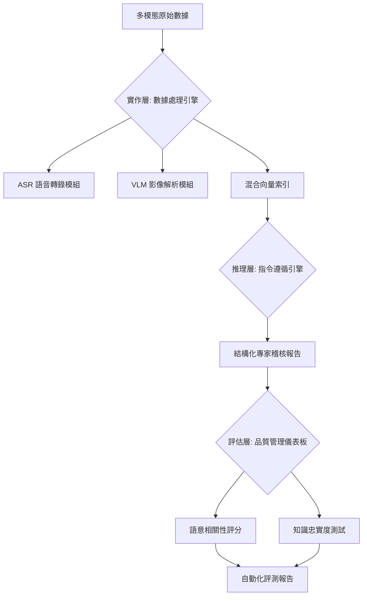

# Enterprise Multimodal RAG & Automated Quality Loop
### 企業級多模態檢索增強生成框架與自動化評測閉環

**核心職能：Technical AI Product Manager** **專案屬性：Model-Agnostic / Enterprise Solution**

---

> **「AI 產品的關鍵競爭力在於：定義明確的品質標準，並建立可量化、可迭代的數據閉環。」**

本專案開發了一套專為企業複雜數據環境設計的 **多模態 RAG 開發框架**。系統核心整合了異質數據（文本、圖像、音訊）的處理能力，並透過內建的 **自動化品質評估閉環 (Evaluation Loop)**，解決了 AI 產品落地時常見的「準確率難以驗證」與「優化方向不明」的技術與管理痛點。

---

## 產品核心價值 (Core Value Proposition)

### 1. 異質數據結構化與整合 (Heterogeneous Data Integration)
* **視覺分析模組**：自動將監控圖表、醫療數據影像轉化為語意描述，解決企業中「影像數據無法被檢索」的斷層。
* **音訊轉錄引擎**：處理會議錄音與現場語音，實現 100% 的多模態數據資產化與結構化。

### 2. 檢索精準度工程 (Precision Engineering)
* **檢索重排與多樣性策略 (Reranking & MMR)**：動態平衡檢索內容的相關性與精簡度，有效解決 LLM 生成內容冗餘與幻覺問題。
* **精準上下文注入**：針對檢索回傳的內容進行過濾與重組，確保模型在生成報告時具備最高相關性的參考資訊。

### 3. 自動化研發閉環 (R&D Evaluation Loop)
* **量化品質指標**：整合語意相似度測試、忠實度（Faithfulness）與相關性（Relevance）測試，提供產品迭代的數據支持。
* **數據驅動優化**：透過評測結果精確定位系統瓶頸，從而引導研發資源投放在最有價值的模組優化上。

---

## 產品品質演進紀錄 (Iteration Journey)

透過內建的評估器，我持續監控系統在不同優化階段的表現。目前的 V6 版本已達成初步商業化驗證指標：

| 版本 | 主要優化策略 | 平均品質得分 (Overall) | 關鍵突破與狀態 |
| :--- | :--- | :--- | :--- |
| **V1** | 基礎 RAG 流程建立 | 0.512 | 驗證異質數據端到端流程可行性 |
| **V4** | MMR 檢索優化 | 0.550 | 有效減少生成內容的資訊重複與冗餘 |
| **V6** | **多模態數據深度整合** | **0.591** | **實現影像/音訊語意對齊，忠實度最高達 0.86** |

> **數據診斷與分析報告**：  
> 根據 V6 評測報告（詳見 Reports 目錄截圖），系統在「答案忠實度 (Faithfulness)」表現優異，顯示模型能準確根據給定資料回答。目前整體得分受限於「檢索相關性 (Relevance)」，這為下一階段導入更精密的檢索重排算法提供了明確的數據指引。

---

## ⚙️ 系統架構 (System Architecture)

本框架採 **「模型無關 (Model-Agnostic)」** 設計，透過統一的 API 封裝，系統可根據企業預算與隱私需求，在雲端高能力模型與地端輕量化模型之間彈性切換。

---

## 設計思維 (Design Philosophy)

### 1. 隱私與合規性考量 (On-Premise Deployment)
考慮到資安與醫療領域的數據敏感性，系統在設計時優先選擇可適配 **輕量化參數規模模型** 的架構，以符合未來地端私有化佈署的產品需求。

### 2. 成本效能平衡 (Cost-Effectiveness)
透過優化檢索品質而非盲目追求大參數模型，系統成功在受限算力下實現專業級回答，顯著降低了長期營運的運算成本。

### 3. 合成數據評測策略 (Synthetic Benchmarking)
專案採用 **Synthetic Data Generation (合成數據生成)** 技術建立基準測試集。透過設計特定 Prompt 指導大型模型針對原始數據產出測試問題與參考對，藉此在研發初期快速建立品質基準線（Baseline），縮短產品驗證週期。

---

## 目錄結構

* `Pipeline/`: 多模態數據處理與 RAG 核心實作
* `Evaluation/`: 自動化評估指標算法 (Semantic, Faithfulness)
* `Benchmarks/`: 包含由 AI 合成的標準測試集 (Synthetic Gold Dataset)
* `Reports/`: 產品品質評測紀錄與量化報告截圖

---
